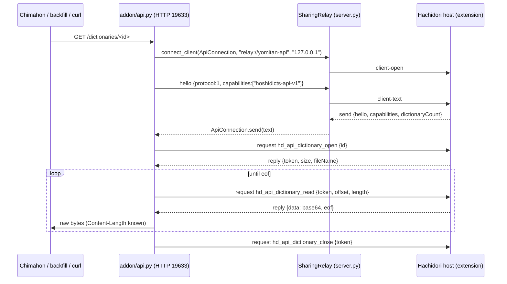

<!-- SPDX-License-Identifier: GPL-3.0-or-later -->

# Host contract for the relay API

This is what a sharing Hachidori (the host) must implement so that the relay's
Yomitan-compatible HTTP API and dictionary downloads work. It is written for
the extension side: nothing here requires reading `addon/api.py`. The Node
fake host in `test/fake-host.mjs` implements exactly this contract with the
canned data in `test/fixtures/host-contract.json`; `test/test_docs.py` checks
that every JSON example below is one of those fixtures, so this document and
the executable specification cannot drift apart.

## Overview

The relay never reads dictionaries itself. When an HTTP request arrives, it
connects to the host as an ordinary sharing client that lives inside the Anki
process, speaks the sharing protocol version 1 (`hello`, `request`, `reply`,
`pong`), and forwards the question as a runtime message of a new `hd_api_*`
type. The host answers the way it answers any linked browser.



## Identity and capability

- The relay's client arrives with `client-open` origin `relay://yomitan-api`
  and address `127.0.0.1`. The host SHOULD recognise this origin as the relay's
  own client (for example to leave it out of the "linked browsers" list). It is
  never a remote computer.
- The host MUST advertise the capability string `hoshidicts-api-v1` in its
  `hello` for any of the endpoints below to work. Without it the relay answers
  every host-backed HTTP request with `501` and a message telling the user to
  update Hachidori. `/serverVersion` works regardless.
- The relay advertises the same capability in its own `hello`, so the host can
  tell an API session from a linked browser without checking the origin.

The relay's `hello`:

```json
{
  "kind": "hello",
  "protocol": 1,
  "version": "hachidori-relay/0.0.4",
  "name": "Hachidori Relay API",
  "capabilities": ["hoshidicts-api-v1"]
}
```

The host's answer, as for any client (`snapshot` may be anything; the relay
ignores it):

```json
{
  "kind": "hello",
  "protocol": 1,
  "version": "0.9.0",
  "name": "Fake Hachidori",
  "dictionaryCount": 2,
  "capabilities": ["hoshidicts-api-v1"],
  "snapshot": {}
}
```

## Frames

Every question is a sharing `request` frame whose `message` has
`target: "hoshidicts-offscreen"` and one of the `type`s in the table. Request
ids are strings of the form `api-<n>`; the host echoes the id in its `reply`.

```json
{
  "kind": "request",
  "id": "api-1",
  "message": { "target": "hoshidicts-offscreen", "type": "hd_api_version" }
}
```

```json
{
  "kind": "reply",
  "id": "api-1",
  "response": { "version": "0.9.0" }
}
```

The relay answers the host's `ping` with `{"kind": "pong"}` and ignores
`storage`. A `bye` from the host, a `close` of the client, or loss of the host
ends the session; every HTTP request waiting on it fails with `503`, and the
next HTTP request opens a fresh session.

The relay waits 30 s for a reply and then answers `504`. A chunk read
(`hd_api_dictionary_read`) may take 60 s; because the HTTP headers are already
out by then, a chunk that never comes ends the download short of its
`Content-Length` instead of producing a status. Replies that arrive after the
relay stopped waiting are dropped, except a late `hd_api_dictionary_open`,
whose token the relay closes at once.

## Message types

The `message` object carries `target`, `type` and the fields shown under
"request". The reply's `response` object has the fields shown under "reply".
Any reply MAY instead be `{"error": "<text>"}`, which the relay turns into
HTTP `500` (Yomitan parity: tools treat it as "no result"). Only
`hd_api_dictionary_open` may add `"notFound": true` to make that a `404`.

```json
{ "error": "no dictionary matched" }
```

| type | request | reply | HTTP |
|------|---------|-------|------|
| `hd_api_version` | `{}` | `{version}` | `POST /yomitanVersion` |
| `hd_api_term_entries` | `{terms: string[]}` | `{results: [{index, dictionaryEntries, originalTextLength}]}` | `POST /termEntries` |
| `hd_api_kanji_entries` | `{characters: string[]}` | `{results: [{index, dictionaryEntries}]}` | `POST /kanjiEntries` |
| `hd_api_anki_fields` | `{text, entryType: "term"\|"kanji", markers: string[], maxEntries, includeMedia}` | `{fields: [...], dictionaryMedia: [...], audioMedia: [...]}` | `POST /ankiFields` |
| `hd_api_anki_card_formats` | `{profileIndex?: number}` | `{cardFormats: [{name, icon, deck, model, fields, type}]}` | `POST /ankiCardFormats` |
| `hd_api_tokenize` | `{texts: string[], scanLength, parser}` | `{results: [...]}` | `POST /tokenize` |
| `hd_api_dictionaries` | `{}` | `{dictionaries: [{id, title, revision, size, fileName}]}` | `GET /dictionaries` |
| `hd_api_dictionary_open` | `{id}` | `{token, size, fileName}` or `{error, notFound: true}` | `GET /dictionaries/<id>` |
| `hd_api_dictionary_read` | `{token, offset, length}` | `{data: base64, eof: bool}` | (same) |
| `hd_api_dictionary_close` | `{token}` | `{}` | (same) |

The relay normalises Yomitan's `string|array` inputs to arrays before
forwarding and unwraps single results before answering HTTP, so the host never
sees that ambiguity. `results` MUST have one element per input, in input
order, each carrying its `index`.

### `hd_api_version`

```json
{}
```

```json
{ "version": "0.9.0" }
```

`version` is the host Hachidori's version. The HTTP answer is this object.

### `hd_api_term_entries`

```json
{ "terms": ["分かる"] }
```

```json
{
  "results": [
    {
      "index": 0,
      "dictionaryEntries": [
        { "type": "term", "isPrimary": true, "headwords": [{ "term": "分かる", "reading": "わかる" }], "definitions": [] }
      ],
      "originalTextLength": 3
    }
  ]
}
```

Each result is what Yomitan's `termsFind` returns (`dictionaryEntries`,
`originalTextLength`) plus `index`. The host renders its entries in Yomitan's
internal `TermDictionaryEntry` shape as far as it can; the example is
abbreviated. For a string input the HTTP answer is `results[0]`; for an array
input it is `results`.

### `hd_api_kanji_entries`

```json
{ "characters": ["分"] }
```

```json
{
  "results": [
    { "index": 0, "dictionaryEntries": [{ "type": "kanji", "character": "分", "dictionary": "KANJIDIC" }] }
  ]
}
```

For a string input the HTTP answer is `results[0].dictionaryEntries` (a bare
array, as Yomitan answers). For an array input, which Yomitan itself does not
accept, it is `results`.

### `hd_api_anki_fields`

```json
{ "text": "分かる", "entryType": "term", "markers": ["expression", "reading"], "maxEntries": 1, "includeMedia": true }
```

```json
{
  "fields": [{ "expression": "分かる", "reading": "わかる" }],
  "dictionaryMedia": [],
  "audioMedia": [
    { "term": "分かる", "reading": "わかる", "mediaType": "audio/mpeg", "content": "AAEC", "ankiFilename": "hachidori_audio_1.mp3" }
  ]
}
```

Yomitan's request field `type` (`term` or `kanji`) travels as `entryType`,
because `type` names the message itself. `maxEntries` is `0` when the caller
did not limit; `includeMedia` is `false` when absent. One `fields` object per
rendered entry, keyed by marker, with the rendered handlebars text. Media
entries carry `content` as base64 and an `ankiFilename` that the `fields`
text refers to (`[sound:...]`, ``). The HTTP answer is this
object unchanged.

### `hd_api_anki_card_formats`

```json
{ "profileIndex": 0 }
```

```json
{
  "cardFormats": [
    {
      "name": "Default",
      "icon": "big-circle",
      "deck": "Mining",
      "model": "Lapis",
      "fields": {
        "Expression": { "value": "{expression}", "overwriteMode": "coalesce" },
        "Sentence": { "value": "{cloze-prefix}<b>{cloze-body}</b>{cloze-suffix}", "overwriteMode": "coalesce" },
        "Hint": { "value": "", "overwriteMode": "coalesce" }
      },
      "type": "term"
    }
  ]
}
```

The host's Anki card formats, so a tool can build notes the way the host does
without the user retyping them: Yomitan's
[`ankiCardFormats`](https://github.com/yomidevs/yomitan-api/blob/main/docs/api_paths/ankiCardFormats.md).
One entry per format, in the host's order, with exactly Yomitan's
`AnkiCardFormat` keys. `fields` maps each note field to its marker template and
overwrite mode (`coalesce`, `coalesce-new`, `skip`, `append`, `prepend` or
`overwrite`); every `{marker}` in a `value` is one `hd_api_anki_fields`
renders. `type` is `term` or `kanji` and `icon` is Yomitan's add-button icon.
Nothing else leaves the host: no AnkiConnect address or key, tags or duplicate
settings.

The relay forwards `profileIndex` only when the body gives a number; without
one the host answers its active profile, as Yomitan reads anything else. A host
answers `{error}` for an index it does not have, with Yomitan's message:
`Invalid input for ankiCardFormats, expected "profileIndex" to be a valid profile index but got 1`.
The HTTP answer is `cardFormats`, a bare array as Yomitan answers.

### `hd_api_tokenize`

```json
{ "texts": ["大きい"], "scanLength": 10, "parser": "scanning-parser" }
```

```json
{
  "results": [
    { "id": "scan", "source": "scanning-parser", "dictionary": null, "index": 0, "content": [[{ "text": "大", "reading": "おお" }, { "text": "きい", "reading": "" }]] }
  ]
}
```

`parser` is `scanning-parser` unless the caller asked for `mecab`. `results`
is Yomitan's `parseText` output, one or more entries per input text, each with
the input's `index`. The HTTP answer is `results` (always an array).

### `hd_api_dictionaries`

```json
{}
```

```json
{
  "dictionaries": [
    { "id": "jitendex", "title": "Jitendex.org [2025-05-13]", "revision": "2025-05-13", "size": 20971520, "fileName": "jitendex.hachidori.zip" },
    { "id": "kanjidic", "title": "KANJIDIC [2025-145]", "revision": "2025-145", "size": 4096, "fileName": "kanjidic.hachidori.zip" }
  ]
}
```

`id` is what `GET /dictionaries/<id>` takes (URL-encoded by the caller,
decoded by the relay; it must not contain `/`). `size` is the archive's byte
length when known. The HTTP answer is this object unchanged.

### `hd_api_dictionary_open`

```json
{ "id": "kanjidic" }
```

```json
{ "token": "dl-1", "size": 4096, "fileName": "kanjidic.hachidori.zip" }
```

```json
{ "error": "unknown dictionary", "notFound": true }
```

The host leases the dictionary's committed generation (as its own backup
export does) and hands out a token. `size` MAY be omitted when unknown; the
relay then answers without `Content-Length` and closes the connection at the
end. `fileName` becomes the `Content-Disposition` file name. The archive is
whatever the host's own Import accepts: a per-dictionary Hachidori backup ZIP
(see Hachidori's `docs/backup-format.md`).

### `hd_api_dictionary_read`

```json
{ "token": "dl-1", "offset": 0, "length": 4194304 }
```

```json
{ "data": "UEsDBBQAAAAIAA==", "eof": true }
```

The relay asks for 4 MiB (`4194304`) at a time, in order, and writes each
chunk as it arrives; it never buffers a whole file. The host MAY return fewer
bytes than `length`; the relay continues from `offset + decoded length`. `eof`
is `true` with the chunk that ends the file (the host may also send an empty
`data` with `eof: true`). An empty `data` without `eof` ends the download as
an error. The offset-based design leaves room for `Range` requests later
without a wire change.

### `hd_api_dictionary_close`

```json
{ "token": "dl-1" }
```

```json
{}
```

The relay always sends `close` for every token the host granted, including
after a client abort, a read error, a chunk timeout, or an `open` answered
after the relay had already given up; it does not wait for the reply. The one
exception is a host that disappears, which releases everything anyway. The host
releases the lease and forgets the token. Reads with a closed or unknown token
are answered with `{error}`.

## Divergences from Kuuuube's yomitan-api

Verified against `docs/api_paths/*.md` and Yomitan's `ext/js/comm/yomitan-api.js`.

- `POST /serverVersion` answers the add-on version as a string (`"0.0.4"`),
  where Yomitan's native-messaging component answers an integer (`1`).
- `POST /kanjiEntries` additionally accepts an array in `character`, answering
  `[{index, dictionaryEntries}]`; Yomitan accepts a string only.
- Errors are JSON objects `{"error": "..."}` with the statuses in the README
  table; Yomitan answers `500` with a JSON-encoded error string and `400` for
  unknown actions (the relay answers `404`).
- `OPTIONS` is answered with CORS headers (`204`); Yomitan answers `405`.
- The `type` field of `/ankiFields` reaches the host as `entryType` (see above);
  the HTTP body itself is unchanged.
